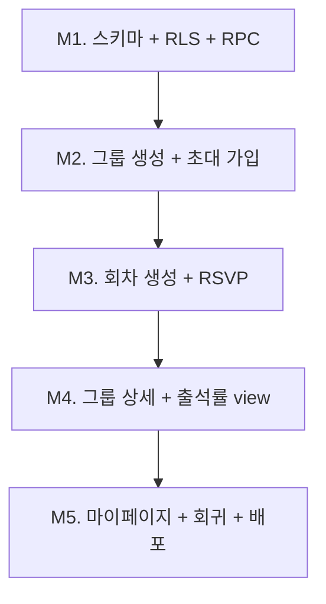

# MVP 설계 — 정기 운동 모임 RSVP·출석 관리

> 작성일: 2026-05-23
> 도메인: 정기 운동 모임 (수영/헬스)
> 베이스: Next.js 15 + Supabase + Tailwind + shadcn (기존 `feat/profiles-table` 브랜치)
> 위치: 본 문서는 신규 도메인 spec이며, 동일 레포의 `docs/PRD.md`(이전 Notion 견적서 도메인)와는 별개

---

## 1. 제품 개요

### 1.1 한 줄 정의

**정기 운동 그룹의 RSVP와 출석률을 누적해서 보여주는 단톡방 보완 도구.** 멤버는 단톡방에 공유된 링크로 한 번 클릭해 응답하고, 주최자는 누가 답했고 누가 얼마나 자주 나오는지를 한 화면에서 본다.

### 1.2 포지셔닝

카카오톡 단톡방의 **대체**가 아닌 **보완**. 공지·잡담은 단톡방에 맡기고, 본 서비스는 단톡방이 잘 못하는 **누적 데이터(누가 답했나 / 누가 얼마나 출석했나)** 한 가지만 잘한다.

### 1.3 핵심 사용자 시나리오

**(A) 주최자 — 수영/헬스 동호회 운영자**

- 그룹 생성 → 초대 링크를 단톡방에 공유 → 멤버가 들어옴
- 매 회차마다 "새 모임" 만들기(날짜·시간·장소 입력, 30초) → 회차 RSVP 링크 단톡방에 공유
- 회차 페이지에서 "갈게요 N명 / 못 가요 M명 / 미응답 K명"을 한 화면에서 확인
- 그룹 페이지에서 멤버별 누적 출석률을 보고 정원·회비 결정에 활용

**(B) 멤버 — 그룹에 속한 운동 동호인**

- 초대 링크 클릭 → Google 로그인 → 그룹 가입
- 단톡방에서 받은 회차 링크 클릭 → "갈게요 / 못 가요" 한 번 탭 → 끝
- 본인 마이페이지에서 본인 출석률 + 다음 모임 일정 확인
- 다른 멤버 응답도 회차 페이지에서 볼 수 있음 (사회적 동기부여)

### 1.4 MVP 범위 (In / Out)

| 포함 (In)                                            | 제외 (Out)                              |
| ---------------------------------------------------- | --------------------------------------- |
| Google OAuth 로그인 (기존 인프라 재사용)             | 이메일/매직 링크/Google 외 OAuth        |
| 그룹 생성 + 초대 링크 (UUID 토큰)                    | 공개 그룹 검색·신청·승인                |
| 그룹 가입 (초대 링크로 1-클릭)                       | 카카오·문자·푸시·이메일 알림 발송       |
| 회차(occurrence) 수동 생성 — 날짜·시간·장소·메모     | 반복 일정·시리즈 자동 생성 (RRULE)      |
| 회차 RSVP 3상태: `going` / `not_going` / `pending`   | 정원/대기열, 인원 제한                  |
| 회차 페이지에 응답 명단 공개 (이름 노출)             | 익명 응답 / 게스트 응답                 |
| 멤버별 누적 출석률 (그룹 멤버에게 공개)              | 출석률 기간 필터·차트 시각화            |
| 그룹 페이지 = 다가오는 회차 + 멤버 목록 + 누적 통계  | 카풀 매칭 / 정산 / 회비 관리            |
| 마이페이지 = 본인 출석 기록 + 다음 모임              | 푸시 알림 / iCal 연동                   |
| 회차 시작 시간 이후 응답 잠금 (응답 = 출석 확정)     | 사후 출석부 수동 정정                   |
| 단일 주최자(그룹 생성자) — 권한 단순화               | 공동 운영자 / 역할 분리                 |
| 다크모드 (기존 `next-themes` 재사용)                 | 다국어 (한국어 외)                      |

---

## 2. 확정 결정 사항

| #   | 영역              | 결정                                                         | 근거                                                                                                  |
| --- | ----------------- | ------------------------------------------------------------ | ----------------------------------------------------------------------------------------------------- |
| 1   | 타깃 시나리오     | **정기 운동 모임** (수영/헬스)                               | 반복 사용·구체적 페인포인트로 MVP 검증 사이클 단축                                                    |
| 2   | 핵심 페인포인트   | **참여자 관리 (RSVP + 출석률)** 하나에 집중                  | 단톡방이 못 푸는 "누적 데이터" 영역, 결제 연동 등 외부 의존 0                                         |
| 3   | 그룹 모델         | **영속 그룹 + 초대 링크 가입**                               | 정기 모임 특성(고정 멤버)에 자연, RLS(행 수준 권한) 설계 단순                                         |
| 4   | RSVP 작동 방식    | **사전 RSVP만 (응답 = 출석 간주)**                           | 마찰 최소, 1테이블(`event_participations`)로 끝나고 `checked_in_at` 컬럼 확장 경로 명확               |
| 5   | 회차 생성         | **주최자가 매 회차 수동 생성**                               | 반복 규칙(RRULE)·예외·타임존 복잡도를 v2로 이연, MVP에서 30초 마찰은 수용 가능                        |
| 6   | 알림 채널         | **자체 알림 없음 — 주최자가 단톡방에 링크 공유**             | 알림 인프라 0개 추가. 단톡방이 이미 알림 인프라로 작동 중                                             |
| 7   | 가시성            | **응답 명단 + 누적 출석률 모두 그룹 멤버에게 공개**          | 단톡방과 동일/그 이상의 가시성 → 사회적 동기부여 작동, RLS 단일 정책으로 단순화                       |
| 8   | 인증              | **Google OAuth 의무** (기존 `feat/profiles-table` 인프라)    | 그룹 멤버십 정합성 보장, 이미 구축돼 추가 작업 0                                                      |
| 9   | 권한              | **단일 주최자**(그룹 생성자가 곧 owner)                      | 권한 행렬 단순, 공동 운영자는 v2에서 owner_id 이전 RPC 또는 역할 테이블로 확장                        |
| 10  | 응답 잠금         | **DB RLS WITH CHECK로 강제** (`events.starts_at > now()`)    | 앱 코드 우회 불가, 보안 표면 최소화                                                                   |
| 11  | 타임존            | **KST 고정** (`Asia/Seoul`)                                  | 타깃 사용자 = 한국 내 운동 모임. 다국어/다지역은 v2+ 범위                                             |
| 12  | 초대 토큰 회전    | **MVP에서 회전 버튼 없음** (생성 시 1회 발급, 영구 유효)     | 토큰 노출 시 단톡방을 새로 만드는 게 더 빠르고, MVP 가치 입증 전 회전 UI는 과잉                       |
| 13  | 회차 필수 필드    | **`location`·`memo` 모두 NOT NULL**                          | 운동 모임 회차는 장소·안내가 사실상 필수. nullable 분기를 화면에서 제거                               |

---

## 3. 데이터 모델

### 3.1 테이블 4종

```sql
-- 1) groups: 영속 그룹. 1 그룹 = 1 주최자.
create table groups (
  id           uuid primary key default gen_random_uuid(),
  name         text not null,                       -- "강남 수영회"
  description  text,
  owner_id     uuid not null references auth.users(id),
  invite_token text not null unique,                -- url-safe base64 32B
  created_at   timestamptz not null default now()
);

-- 2) group_members: 그룹 ↔ 사용자 N:M
create table group_members (
  id        uuid primary key default gen_random_uuid(),
  group_id  uuid not null references groups(id) on delete cascade,
  user_id   uuid not null references auth.users(id) on delete cascade,
  joined_at timestamptz not null default now(),
  unique (group_id, user_id)
);

-- 3) events: 회차(occurrence). 매 회차 수동 생성.
create table events (
  id         uuid primary key default gen_random_uuid(),
  group_id   uuid not null references groups(id) on delete cascade,
  title      text,                                  -- nullable: 기본은 그룹명
  starts_at  timestamptz not null,                  -- KST로 표시, UTC로 저장. 응답 잠금의 기준
  location   text not null check (char_length(location) between 1 and 200),
  memo       text not null check (char_length(memo)     between 1 and 1000),
  created_by uuid not null references auth.users(id),
  created_at timestamptz not null default now()
);

-- 4) event_participations: 회차별 RSVP. 3-상태.
create table event_participations (
  id           uuid primary key default gen_random_uuid(),
  event_id     uuid not null references events(id) on delete cascade,
  user_id      uuid not null references auth.users(id) on delete cascade,
  status       text not null check (status in ('going','not_going','pending')),
  responded_at timestamptz not null default now(),
  unique (event_id, user_id)
);
```

### 3.2 인덱스

| 테이블                  | 인덱스                                     | 용도                                  |
| ----------------------- | ------------------------------------------ | ------------------------------------- |
| `groups`                | `invite_token` (unique 자동)               | 초대 링크 조회                        |
| `group_members`         | `(group_id, user_id)` (unique 자동)        | 멤버십 검증 + 멤버 목록               |
| `events`                | `(group_id, starts_at desc)`               | 그룹 페이지 회차 정렬                 |
| `event_participations`  | `(event_id, user_id)` (unique 자동)        | 회차 페이지 응답 카운팅 + 본인 응답   |

### 3.3 누적 출석률 VIEW

```sql
create view group_attendance_stats with (security_invoker = true) as
select
  gm.group_id,
  gm.user_id,
  count(*) filter (where ep.status = 'going')   as attended,
  count(*) filter (where e.starts_at < now())   as total_past
from group_members gm
left join events e
  on e.group_id = gm.group_id
  and e.starts_at < now()
left join event_participations ep
  on ep.event_id = e.id
  and ep.user_id = gm.user_id
group by gm.group_id, gm.user_id;
```

- `security_invoker = true`로 호출자의 RLS를 상속
- 비율 계산은 클라이언트에서 (`total_past === 0`이면 "—" 렌더)

**카운팅 규칙 (응답 = 출석의 정확한 의미)**:

| 상태                       | 출석 카운트 | 비고                                                      |
| -------------------------- | ----------- | --------------------------------------------------------- |
| `going`                    | 출석        | view `attended`에 카운트                                  |
| `not_going`                | 결석        | 카운트 0                                                  |
| `pending` (또는 행 없음)   | 결석        | 회차 시작 후 미응답은 RLS WITH CHECK로 굳어져 `pending`/없음 유지 → 결석 처리 |

분모 `total_past`는 **`starts_at < now()`인 회차 수**로 일정하다 (응답 유무와 무관). 즉 한 멤버가 응답을 하지 않고 회차가 지나가면 그대로 결석 1회로 누적된다.

### 3.4 표시 이름 + 기존 `profiles` 테이블 RLS 보강

응답 명단·멤버 출석률 표에 표시되는 **이름**은 기존 `public.profiles` 테이블에서 가져온다:

- 우선순위: `profiles.full_name` → `profiles.username` → `'(이름 미설정)'` fallback
- Google OAuth 가입 시 `raw_user_meta_data.full_name`이 자동 채워지므로 대부분 비어있지 않음 (기존 `handle_new_user()` 트리거)
- 아바타: `profiles.avatar_url` 사용 (없으면 shadcn `Avatar` 기본 이니셜)

**RLS 보강 필요** — 현재 `profiles_select_own` 정책은 `auth.uid() = id`만 허용한다. 같은 그룹 멤버의 이름을 보려면 정책을 추가한다:

```sql
create policy profiles_select_group_members on public.profiles
  for select using (
    exists (
      select 1
      from public.group_members gm_self
      join public.group_members gm_other
        on gm_self.group_id = gm_other.group_id
      where gm_self.user_id = (select auth.uid())
        and gm_other.user_id = profiles.id
    )
  );
```

기존 `profiles_select_own`과 OR로 합쳐져 "본인 OR 같은 그룹 멤버"가 read 가능. 이 정책은 `groups`·`group_members` 테이블 생성 **이후**에 추가되어야 하므로 본 MVP 마이그레이션 안에 포함한다.

### 3.5 RLS 무한 재귀 회피 헬퍼

`group_members_select_same_group` 정책이 `group_members` 자신을 subquery로 참조하면 PostgreSQL이 RLS 평가 중 동일 정책을 재귀 호출해 ERROR 42P17가 발생한다. 표준 해결책은 `SECURITY DEFINER` 헬퍼 함수로 RLS를 우회하는 것:

```sql
create or replace function public.is_group_member(p_group_id uuid, p_user_id uuid)
returns boolean
language sql
security definer
stable
set search_path = public
set row_security = off  -- security definer만으론 RLS 우회 부족, 명시 필요
as $$
  select exists (
    select 1 from public.group_members
    where group_id = p_group_id and user_id = p_user_id
  );
$$;
```

**중요**: `set row_security = off`를 빼면 함수 내부 `select`가 다시 `group_members` RLS 정책을 호출해 또 다른 무한 재귀가 발생한다 (Phase 1 OAuth 수동 검증 중 `createGroupAction`에서 `group_members.insert`가 실패하며 발견된 누락).

`group_members_select_same_group` 정책은 이 함수를 호출하도록 작성한다:

```sql
create policy group_members_select_same_group on public.group_members
  for select using (
    public.is_group_member(group_id, (select auth.uid()))
  );
```

다른 정책들은 `group_members`를 **외부에서** 참조하므로 (예: `groups_select_member_or_owner`, `events_select_group_member`, `ep_select_group_member`, `profiles_select_group_members`) 재귀가 발생하지 않는다. 헬퍼 함수 도입은 `group_members` 정책 하나에만 영향.

### 3.6 가입 RPC

```sql
create or replace function join_group_by_token(token text)
returns uuid             -- 가입한 그룹의 id
language plpgsql
security definer
set search_path = public
as $$
declare
  v_group_id uuid;
begin
  -- 1) 토큰으로 그룹 찾기
  select id into v_group_id from groups where invite_token = token;
  if v_group_id is null then
    raise exception 'invalid_invite_token';
  end if;

  -- 2) 이미 가입돼 있으면 그룹 id만 반환 (멱등)
  if exists (
    select 1 from group_members
    where group_id = v_group_id and user_id = auth.uid()
  ) then
    return v_group_id;
  end if;

  -- 3) 멤버십 행 삽입
  insert into group_members (group_id, user_id) values (v_group_id, auth.uid());
  return v_group_id;
end;
$$;

revoke all on function join_group_by_token(text) from public;
grant execute on function join_group_by_token(text) to authenticated;
```

---

## 4. RLS 정책

| 테이블                      | SELECT                                | INSERT                                                                                | UPDATE                                                       | DELETE                                |
| --------------------------- | ------------------------------------- | ------------------------------------------------------------------------------------- | ------------------------------------------------------------ | ------------------------------------- |
| `profiles` (기존)           | 본인 OR 같은 그룹 멤버 (정책 추가)    | 본인 (기존 정책)                                                                      | 본인 (기존 정책)                                             | × (기존)                              |
| `groups`                    | 본인이 멤버이거나 owner               | 로그인 사용자, `owner_id = auth.uid()` 강제                                           | owner만                                                      | owner만                               |
| `group_members`             | 같은 그룹의 멤버 (서로 보임)          | owner 본인 행만 허용 (그룹 생성 흐름). 외부 사용자 가입은 `join_group_by_token` RPC만 | × (없음)                                                     | 본인 행만 (탈퇴)                      |
| `events`                    | 그룹 멤버                             | owner만                                                                               | owner만                                                      | owner만                               |
| `event_participations`      | 같은 그룹 멤버 (응답 명단 공개)       | 본인 행 + `EXISTS(events where id = event_id and starts_at > now())`                  | 동일 조건 (잠금 강제)                                        | 본인 행 (잠금 무관, 응답 취소 허용)   |
| `group_attendance_stats`    | 같은 그룹 멤버 (view에 RLS 상속)      | —                                                                                     | —                                                            | —                                     |

**핵심 한 줄**: `event_participations`의 INSERT/UPDATE `WITH CHECK`에 `EXISTS (select 1 from events where id = event_id and starts_at > now())`를 박아 잠금 로직을 DB 레이어에서 강제.

---

## 5. 라우팅 + 화면

### 5.1 라우트 트리

```
app/
├─ page.tsx                          # 홈: 비로그인=랜딩 / 로그인=내 그룹 목록
├─ auth/...                          # 기존 (Google OAuth) — 그대로 재사용
├─ me/
│  └─ page.tsx                       # 마이페이지: 다음 모임 + 그룹별 출석률
├─ groups/
│  ├─ new/
│  │  └─ page.tsx                    # 그룹 생성 폼
│  └─ [groupId]/
│     ├─ layout.tsx                  # 그룹 권한 검증 + 그룹 정보 props
│     ├─ page.tsx                    # 그룹 상세
│     └─ events/
│        ├─ new/
│        │  └─ page.tsx              # 회차 생성 폼 (owner만)
│        └─ [eventId]/
│           └─ page.tsx              # 회차 상세 (RSVP + 응답 명단)
└─ invite/
   └─ [token]/
      └─ page.tsx                    # 초대 링크 관문 (3분기)
```

### 5.2 핵심 화면 명세

**그룹 상세 `/groups/[groupId]`** — 4 블록 구성:

1. 헤더: 그룹명·설명 + 초대 링크 복사 버튼(owner만)
2. 다가오는 회차 카드 1~N개: 일시·장소 + 응답 카운트 + 본인 응답 빠른 토글 + "새 모임 만들기"(owner만)
3. 멤버 출석률 표: 이름 / 출석/전체 / 출석률(%) / 가입일
4. 지난 회차 접힌 목록 (default 접힘)

**회차 상세 `/groups/[groupId]/events/[eventId]`**:

- 일시·장소·메모 헤더
- 본인 RSVP 3-버튼 토글 (회차 시작 후엔 "🔒 응답 마감" 배지)
- 응답 명단 3그룹: `going` / `not_going` / `pending` 각각 이름 나열

**초대 관문 `/invite/[token]`** — 4분기:

| 상태                  | 동작                                                                              |
| --------------------- | --------------------------------------------------------------------------------- |
| 비로그인              | 그룹명 미리보기 + Google 로그인 버튼 (로그인 후 같은 URL로 복귀)                  |
| 로그인 + 미가입       | "[그룹명] 가입하시겠습니까?" + 가입 버튼 → RPC → `/groups/[id]` redirect          |
| 로그인 + 이미 가입    | 즉시 `/groups/[id]` redirect                                                      |
| 토큰 무효             | "유효하지 않은 초대 링크입니다" + 홈 버튼만 (그룹 정보 노출 0)                    |

**마이페이지 `/me`**: 다음 모임 카드(1~3개) + 그룹별 누적 출석률 표.

### 5.3 Server Actions (4개)

| Action               | 입력                                         | 동작                                                                          |
| -------------------- | -------------------------------------------- | ----------------------------------------------------------------------------- |
| `createGroup`        | `{ name, description }`                      | `groups` insert → 본인을 `group_members`에 자동 insert → `/groups/[id]`       |
| `joinGroupByToken`   | `{ token }`                                  | RPC `join_group_by_token` 호출 → 그룹 id 반환 → `/groups/[id]` redirect       |
| `createEvent`        | `{ groupId, startsAt, location, memo }`      | `events` insert (owner 검증은 RLS, `location`·`memo` 필수)                    |
| `respondToEvent`     | `{ eventId, status }`                        | `event_participations` upsert (잠금은 RLS WITH CHECK)                         |

### 5.4 Client Component (island) 4종

`'use client'` 필요한 최소 단위:

- `RsvpButtons` — 3-상태 토글 + `useTransition` 낙관적 업데이트
- `CopyInviteLinkButton` — `navigator.clipboard` + sonner 토스트
- `EventDateTimePicker` — 회차 생성 폼의 날짜·시간 입력
- `JoinGroupConfirmButton` — 초대 관문의 가입 확인 (Server Action 호출 + 진행 상태)

나머지는 모두 Server Component. shadcn `Card`, `Button`, `Table`, `Badge`, `Avatar`, `Dialog`, `Input`, `Textarea`, `Separator`, `Toaster`(sonner) 재사용.

---

### 5.5 PPR 적응 패턴 (`cacheComponents: true`)

`next.config.ts`에 `cacheComponents: true`가 설정되어 있어 Next 15의 PPR(Partial Prerendering)이 활성화된다. 이 환경에서는 Server Component page의 최상위에서 `await`(특히 `supabase.auth.getClaims()` 같은 동적 데이터 fetching)를 호출하면 빌드가 깨진다. 모든 Server Component page는 다음 패턴으로 작성:

```tsx
async function PageContent({ /* params */ }: { /* ... */ }) {
  // 실제 데이터 fetching·인증 검증·redirect는 여기서
  const supabase = await createClient();
  // ...
  return <>{/* 페이지 본문 */}</>;
}

export default async function Page(props: { params: Promise<{ ... }> }) {
  const params = await props.params;  // params 해석은 page에서 OK
  return (
    <main>
      <Suspense fallback={null}>
        <PageContent {...params} />
      </Suspense>
    </main>
  );
}
```

기존 `app/protected/page.tsx`가 이 패턴의 참고 구현이고, 본 MVP의 `/groups/new`, `/groups/[groupId]`, `/invite/[token]`, `/` 모두 같은 패턴을 따른다. 빌드 시 라우트 표기는 `◐ (Partial Prerender)`.

### 5.6 proxy 화이트리스트

`lib/supabase/proxy.ts`의 기본 인증 가드는 `/`, `/login*`, `/auth*` 외 모든 경로를 `/auth/login`으로 redirect한다. 본 MVP의 `/invite/<token>` 경로는 **비로그인 사용자가 그룹명·"Google로 로그인" 버튼을 보는 분기**(spec §5.2 초대 관문 §분기 b)가 작동해야 하므로 화이트리스트에 추가:

```ts
if (
  request.nextUrl.pathname !== "/" &&
  !user &&
  !request.nextUrl.pathname.startsWith("/login") &&
  !request.nextUrl.pathname.startsWith("/auth") &&
  !request.nextUrl.pathname.startsWith("/invite/")   // ← 본 MVP에서 추가
) { /* redirect to /auth/login */ }
```

이 보강 없이는 V4(무효 토큰 → 거부 화면)와 분기 (b) 둘 다 작동하지 않는다 (Phase 1 자동 검증에서 발견된 누락).

## 6. 마일스톤 (1인 개발 5~7영업일 예상)

### M1. 스키마 + RLS + RPC (1d)

- 마이그레이션 1개 (`supabase/migrations/20260523_create_event_tables.sql`): 4 테이블 + 인덱스 + RLS 정책 + view + `join_group_by_token` RPC + 기존 `profiles` 테이블에 `profiles_select_group_members` 정책 추가
- `mcp__supabase__generate_typescript_types`로 `lib/database.types.ts` 갱신
- service_role로 더미 데이터(그룹 1 + 사용자 2 + 회차 1 + RSVP 2) 삽입 검증

**Done =**
- `npm run build` 통과, 타입 0 에러
- anon 키로 `groups.select()` 시 0 row
- service_role 시드 스크립트가 4 테이블 모두에 행 삽입 성공

### M2. 그룹 생성 + 초대 가입 흐름 (1.5d)

- 페이지: `/groups/new`, `/invite/[token]`, `/` (내 그룹 목록만 우선)
- Server Actions: `createGroup`, `joinGroupByToken`
- 초대 토큰: `crypto.randomBytes(32).toString('base64url')` (`lib/tokens.ts`)
- 초대 관문 4분기 명시 (비로그인/미가입/이미가입/무효)

**Done =**
- 사용자 A: 그룹 생성 → 초대 URL 표시 → 클립보드 복사
- 사용자 B(시크릿 창): 같은 URL 접속 → Google 로그인 → 가입 버튼 → 그룹 페이지 진입
- 같은 URL 재접속 시 즉시 그룹 페이지로 redirect

### M3. 회차 생성 + RSVP (1.5d)

- 페이지: `/groups/[id]/events/new`, `/groups/[id]/events/[eventId]`
- Server Actions: `createEvent`, `respondToEvent`
- Client Island: `RsvpButtons` 낙관적 업데이트
- 회차 시작 시간 이후 UI 잠금 + RLS 거부 시 토스트 메시지

**Done =**
- 주최자가 회차 생성 → 회차 상세 페이지 진입
- 멤버 "갈게요" 클릭 → 응답 명단에 본인 이름 즉시 반영
- 시작 시간 1분 후 응답 변경 시도 → DB 거부 + "응답이 마감되었습니다" 토스트
- 비-owner가 `/events/new` 직접 접근 → 그룹 페이지 redirect

### M4. 그룹 상세 + 누적 출석률 view (1d)

- 페이지: `/groups/[id]` 4-블록 완성
- view `group_attendance_stats` SELECT + 클라 비율 계산
- 다가오는 회차 카드 본인 응답 빠른 토글 (회차 상세 안 들어가도 응답 가능)

**Done =**
- 더미 데이터 10 멤버 × 10 회차로 출석률 표 자연스럽게 렌더
- `total_past === 0`일 때 "—" 표시 (NaN/Infinity 노출 X)
- 모바일 360px 가독성 유지 (가로 스크롤 없음)

### M5. 마이페이지 + 회귀 + 배포 (0.5~1d)

- 페이지: `/me`
- 홈(`/`) 페이지 "내 그룹 목록" 카드 정리
- 회귀: V1~V8 + RLS 침투 + 빌드/린트/타입
- 배포: Vercel + Supabase 환경변수 검증

**Done =** §7 검증 기준 모두 PASS

---

## 7. 검증 기준

### 7.1 수동 시나리오 (V1~V8)

| ID  | 시나리오                                                          | 기대 결과                                                            |
| --- | ----------------------------------------------------------------- | -------------------------------------------------------------------- |
| V1  | 신규 사용자가 그룹 생성 → 초대 URL 복사                           | 클립보드 저장 + 그룹 페이지 200                                      |
| V2  | 다른 사용자가 초대 URL 클릭 → Google 로그인 → 가입                | `/groups/[id]` 진입 + 멤버 목록에 본인 추가                          |
| V3  | 가입된 사용자가 같은 초대 URL 재방문                              | 즉시 그룹 페이지로 redirect (가입 다이얼로그 X)                      |
| V4  | 무효 토큰으로 `/invite/[token]` 접근                              | "유효하지 않은 초대 링크" 화면, 그룹 정보 노출 0                     |
| V5  | 주최자가 회차 생성 → 멤버 B가 "갈게요" 클릭                       | 본인 + **다른 멤버 A의 이름이 응답 명단에 표시** (profile 정책 검증) |
| V6  | 회차 시작 시간 이후 응답 변경 시도                                | DB 거부 + 잠금 배지 + 토스트 "응답이 마감되었습니다"                 |
| V7  | 비-owner 멤버가 `/groups/[id]/events/new` 직접 URL 진입           | 그룹 페이지로 redirect (회차 생성 폼 노출 X)                         |
| V8  | 비멤버가 `/groups/[id]` 직접 URL 진입                             | 홈으로 redirect 또는 404 (그룹 정보 노출 0)                          |

### 7.2 자동 검증

- `npm run build` 통과
- `npm run lint` 무경고
- TypeScript 타입 에러 0
- 빌드 산출물에 `SUPABASE_SERVICE_ROLE` 미포함 (grep 확인)

### 7.3 RLS 침투 테스트

anon 키 / 다른 그룹 멤버 세션으로 직접 시도:

- 비로그인 anon `groups.select()` → 0 row
- 비로그인 anon `event_participations.insert()` → 거부
- 그룹 A 멤버가 그룹 B의 `events.select()` → 0 row
- 그룹 A 멤버가 그룹 B의 **타인 `profiles.select()`** → 0 row (정책 분리 검증)
- 회차 시작 후 본인 RSVP `update` → WITH CHECK 거부

---

## 8. 리스크

| ID  | 항목                                                          | 대응                                                                                                                            |
| --- | ------------------------------------------------------------- | ------------------------------------------------------------------------------------------------------------------------------- |
| R1  | `invite_token`이 단톡방에 공개돼 외부인 클릭 가능              | 토큰=가입권은 의도된 동작 (결정 #12). RLS는 가입 후에도 `group_members` 행 존재를 이중 검증. **토큰 회전 버튼은 MVP 비범위** — 노출 시 새 그룹 생성으로 우회 |
| R2  | `events.starts_at` 타임존 혼동 (서버=UTC vs 사용자=KST)        | 결정 #11에 따라 **KST 고정**. 모든 timestamp는 `timestamptz`로 저장(UTC), 화면 표시는 `Intl.DateTimeFormat('ko-KR', { timeZone: 'Asia/Seoul' })` / `<input type="datetime-local">`은 KST로 해석 후 ISO 직렬화 |
| R3  | 출석률 분모 0일 때 NaN/Infinity 노출                          | 클라이언트가 `total_past === 0`이면 "—" 렌더                                                                                    |
| R4  | 멤버 탈퇴 시 과거 RSVP 행 처리                                | `event_participations.user_id` ON DELETE CASCADE 적용 — 탈퇴 즉시 통계에서 사라짐. "탈퇴자 보존" 옵션은 v2                       |
| R5  | 회차 직전 동시 RSVP 폭주                                      | `event_participations` `unique(event_id, user_id)` + upsert로 멱등 보장                                                          |
| R6  | 주최자 계정 분실 (소유권 이전 불가)                           | MVP 범위 외. v2에서 owner_id update RPC 또는 공동 운영자 도입                                                                   |
| R7  | 초대 토큰 무차별 추측                                         | UUID v4 또는 256-bit URL-safe base64로 추측 불가. rate-limit는 v2                                                                |

---

## 9. 환경 변수

기존 Supabase 변수 재사용. 추가 변수 0개.

| 키                                  | 용도                                                | 비고                          |
| ----------------------------------- | --------------------------------------------------- | ----------------------------- |
| `NEXT_PUBLIC_SUPABASE_URL`          | Supabase 프로젝트 URL                                | 기존 사용                     |
| `NEXT_PUBLIC_SUPABASE_ANON_KEY`     | anon 공개 키                                        | 기존 사용                     |
| `SUPABASE_SERVICE_ROLE`             | 시드 스크립트 전용 (앱 코드에서 import 금지)        | 기존 사용                     |

Google OAuth 클라이언트 ID/Secret은 Supabase Auth 콘솔에 등록돼 있어 앱 env에는 노출되지 않음 (기존 `feat/profiles-table`에서 이미 구성).

---

## 10. 비범위 (v2+ 후보)

본 MVP의 가치가 검증되면 다음 단계로 자연스러운 확장:

- **초대 토큰 회전 / 회수** — 토큰 노출 시 주최자가 새 토큰 발급 (구 토큰 무효화)
- **다국어 / 멀티 타임존** — KST 외 지역 사용자 지원
- **카풀 매칭** — 회차별 출발지·도착지 매칭, 동승 인원
- **회비·정산** — 회비 납부 추적, 회차별 비용 분담
- **카카오 알림톡** — 사업자 등록 후 회차 생성 시 자동 발송
- **반복 일정 (RRULE)** — "매주 화/목 19:00" 같은 자동 occurrence 생성
- **공동 운영자** — 역할 테이블 + owner 이전
- **정원 / 대기열** — 인원 제한 + 자동 대기열 승격
- **출석 차트** — 기간 필터 + 시각화 (월별 출석률 추이)
- **공개 그룹** — 검색·신청·승인 워크플로
- **iCal / Google Calendar 연동** — 회차 자동 캘린더 추가
- **PWA 푸시** — iOS 16.4+ 대응

---

## 11. 의존성 그래프



각 M의 출력이 다음 M의 입력. M3·M4 사이 화면 분기점은 있으나 데이터 의존 직선.
